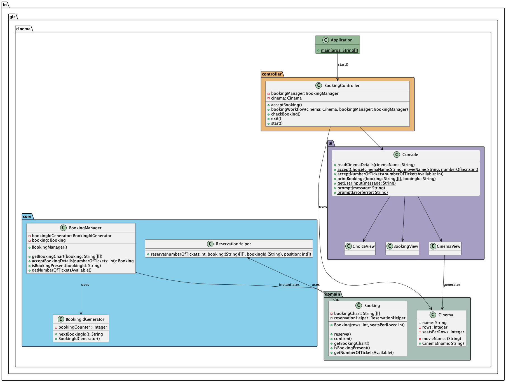
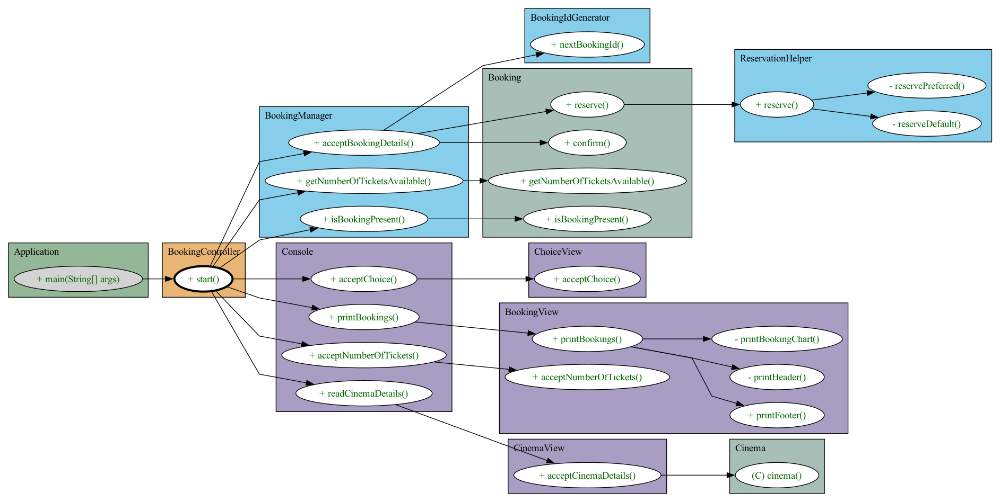

# GIC Cinemas Booking System

Welcome to the  Cinemas Booking System. This document provides a comprehensive guide to help you understand, build, and run the project locally.

## Overview

The  Cinemas Booking System is designed to facilitate the booking of cinema tickets through a simple and intuitive interface. Built with Java and Spring Boot, and managed with Maven, this project encapsulates the core functionalities needed for managing cinema bookings.

### Class Diagram

To understand the structure of the code, please refer to the `class-diagram.png` in the project root. This diagram illustrates the relationships between the various classes and components within the system.


### Code Flow

For a detailed explanation of the code flow, including how the components interact with each other, please see `flow-diagram.png`. This flowchart provides a visual representation of the process from booking tickets to managing cinema details.


## Getting Started

### Prerequisites

- Java JDK 11 or later
- Maven 3.6.0 or later
- An IDE of your choice (e.g., IntelliJ IDEA)

### Build and Setup

1. **Clone the Repository**

   ```bash
   git clone https://github.com/nileshapgar/movie-ticket-booking.git
   cd movie-ticket-booking
   ```
2. **Build the Project**

   ```bash
   mvn clean install
   or
   mvn clean install -DskipTests
   ```
3. **Run the Application**

   ```bash
   java -jar target/movie-tiket-booking-0.0.1-SNAPSHOT.jar
   ```
   
### Execution Recording
In case of build and setup failure, you can see the execution recording, please refer to the `movie-ticket-booking-running-flow.mov` in the project root. This video demonstrates running flow of application.
[](https://www.youtube.com/watch?v=kimRjogGEDs)